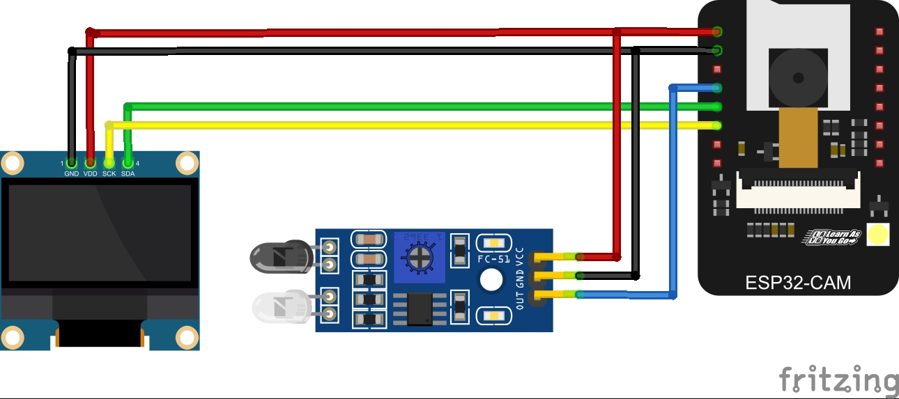
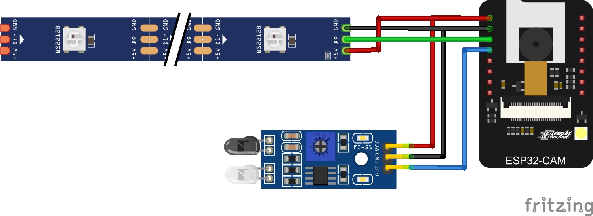

## Schematics
Gate:

Node:

## If you have driver issue by checking the Device Manager and see 

use this link to download the appropriate driver:
https://learn.sparkfun.com/tutorials/how-to-install-ch340-drivers/all#drivers-if-you-need-them

place the files inside a directory and use the path to install the drivers using the Device Manager
1.Right click on the unrecognized Device
2.Update driver
3.Browse my computer for drivers

## Start the server 
Run `python app.py`

## If you can't connect to the server
1. Make sure the board prints IP address in Serial Monitor
2. Make sure your firewall is not blocking incoming requests

## To upload code:
1. Press on the Download mode button on the ESP-32 board before plug in the usb cable
2. Then plug in the cable and continue pressing for one second
3. Release the button and click upload in your IDE of choice

## Limitations:
1. It turns out that the ESP32-CAM ADC1 pins are not accessed from the board and might be used by the Camera.
This leaves us with the ADC2 pins, but they cannot be used if the Wifi radio is on. The solution is to read analog data when not connecting to wifi.
THIS IS ONLY RELATED TO ANALOG IR SENSOR. BINARY DIGITAL SENSOR SHOULD WORK FINE.